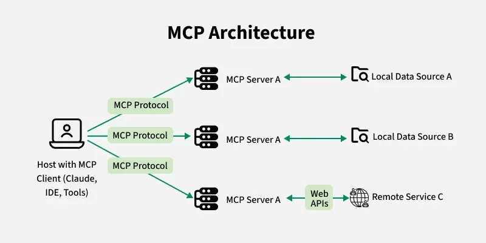
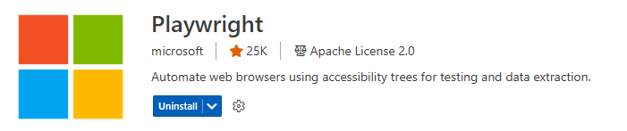
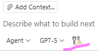

# Learn MCP Tools with GitHub Copilot

Master the Model Context Protocol (MCP) in GitHub Copilot to safely use tools, browse, and work across services from right inside Copilot Chat.

## What Is MCP (and Why It Matters)

MCP is a protocol that lets language models reliably use tools and keep context over time. With MCP, assistants can:

- Use tools and services (e.g., Azure, GitHub, browser automation)
- Maintain persistent state and memory between turns
- Reason across sessions and invoke functions dynamically
- Coordinate multiple tools predictably and securely

Traditional request/response APIs weren’t designed for multi-turn reasoning or tool orchestration. MCP fills that gap with a stateful, extensible protocol tailored to AI assistants and copilots.



## Key Concepts

- **MCP Server:** A packaged tool provider (e.g., Azure MCP, GitHub MCP, Playwright MCP).
- **Tool:** A concrete capability exposed by a server (e.g., list resource groups, fetch PRs, navigate pages).
- **State/Memory:** Servers can preserve context to enable multi-step workflows.
- **Routing:** Copilot selects and sequences tools to achieve your goal.

## Prerequisites

- VS Code with the GitHub Copilot Chat extension (latest recommended)
- Internet access and sign-in to required services
- Optional per-tool setup:
	- Azure: `az` CLI and an authenticated session
	- GitHub: Signed into GitHub in VS Code with appropriate repo/org access
	- Playwright: Browser install handled by the MCP server (will prompt if needed)

## Install and Enable MCP Servers

1) Install MCP servers from the VS Code Marketplace:
	 - Open Extensions view and search for `@mcp`
	 - Install servers you want, such as:
		 - Azure (MCP)
		 - GitHub (MCP)
		 - Playwright (MCP)



2) Enable tools in Copilot:
	 - Open Command Palette → “GitHub Copilot: Manage MCP Tools”
	 - Check the tools you want to expose to Copilot Chat (Azure, GitHub, Playwright)



## Verify Your Setup

- Azure
	- Ensure you’re logged in:

		```powershell
		az login
		```

	- In Copilot Chat, type `@azure` and confirm suggestions appear.

- GitHub
	- Ensure VS Code is signed into GitHub with access to your repos.
	- In Copilot Chat, type `@github` and confirm suggestions appear.

- Playwright
	- In Copilot Chat, type `@playwright` (or `@browser`) and confirm suggestions appear.
	- If prompted to install browsers, follow the on-screen steps.

## Quickstart Exercises (Copy/Paste)

Try these prompts directly in Copilot Chat after enabling the corresponding tools.

1) Azure: List resource groups and regions
- Prompt: “@azure Generate a table listing all my resource groups along with their corresponding regions.”
- If you see a login prompt, complete `az login` and retry.

2) Azure: Cost insight
- Prompt: “@azure What was my most expensive resource last month?”

3) GitHub: Recent commits
- Prompt: “@github List the last 10 commits in kostinams/github-copilot-use-cases.”
	- Replace with your repo if needed, e.g., `owner/repo`.

4) Browser (Playwright): Navigate and extract info
- Prompt: “@playwright Navigate to Yahoo Finance and find MSFT stock price.”

5) Azure Docs Q&A
- Prompt: “@azure In which Azure regions is the gpt-5 model available?”

6) Multi-tool workflow: Read, summarize, and save
- Prompt: “Find the AI landing zone document, read it, summarize it, and store it in a Markdown file under the docs folder.”
	- Copilot may use browsing to find and read the document, then create a summary file in `docs/`.

## Tips and Best Practices

- **Name the tool:** Start prompts with `@azure`, `@github`, or `@playwright` to nudge the right server.
- **Be specific:** Include repo names, resource groups, or page targets to reduce ambiguity.
- **Iterate:** Ask follow-ups like “filter to prod only” or “save output to docs/summary.md”.
- **Least privilege:** Enable only the MCP tools and scopes you need for your task.
- **Secrets & auth:** Don’t paste secrets into chat. Use `az login` for Azure and VS Code GitHub sign-in for GitHub.
- **Traceability:** For impactful actions (e.g., creating files), ask Copilot to show what it plans to do before executing.

## Troubleshooting

- Tool not visible in Chat
	- Confirm the server is installed and enabled via “GitHub Copilot: Manage MCP Tools”.
	- Reload VS Code window if the tool list looks stale.

- Azure auth issues
	- Run `az login` (or `az account set --subscription <id>`). Re-run the prompt.
	- Ensure your account has permissions to list/query the requested resources.

- GitHub permission errors
	- Verify VS Code is signed into the correct GitHub account.
	- Ensure repo/org access is granted; re-auth if needed.

- Playwright/browser prompts
	- Allow the MCP server to install required browsers. Retry the prompt.

- Network/proxy limitations
	- Confirm your proxy settings allow marketplace, GitHub, and Azure endpoints.

## Security Considerations

- **Least privilege:** Only enable tools and scopes essential for your task.
- **Review actions:** When a tool offers to create/update files or access external resources, review the plan.
- **No hardcoded secrets:** Use authenticated sessions (Azure CLI, VS Code GitHub sign-in) rather than pasting tokens.
- **Data handling:** Assume prompts and tool outputs can be transmitted to providers; follow your org’s data policies.

## References

- MCP Servers Registry:
	- https://github.com/mcp?utm_source=vscode-website&utm_campaign=mcp-registry-server-launch-2025
	- https://github.com/modelcontextprotocol/servers
- GitHub Copilot docs: https://docs.github.com/en/copilot
- Model Context Protocol: https://modelcontextprotocol.io/

# WHY MCP
To put it simply, MCP serves as a link that allows language models to comprehend, preserve, and make use of context throughout time. It specifies how models are able to:

- Use tools or long-term memory
- Keep the persistent state
- Reason between sessions
- Invoke services or functions dynamically

Because of this, it is particularly useful for developing sophisticated applications such as multi-turn assistants, copilots, and autonomous agents.

Conventional APIs were not made for language models or dynamic reasoning agents but rather for request-response paradigms. Despite their continued strength, APIs are inadequate in the following areas:

- Controlling long-term memory
- Using reasoning in several phases or sessions
- Managing the routing of dynamic tools
- Using a variety of tools to coordinate in an organized manner

By providing a stateful, adaptable, and extendable protocol designed to simulate interaction patterns, MCP fills these shortcomings.


### Check MCP Servers
- Here you can find a list of MCP servers: 

https://github.com/mcp?utm_source=vscode-website&utm_campaign=mcp-registry-server-launch-2025

https://github.com/modelcontextprotocol/servers

- Follow the instructions for each MCP server to install and activate it.

Go to : VS Code Extensions 
type @mcp
Type Playwright , locate the MCP server and install


Make sure the required tools (Azure MCP, GitHub MCP, Playwright) are selected under the tools in GitHub Copilot:


### Prompts to ask in Agent mode:

> - navigate to Yahoo finance and find MSFT stock price
> - @azure Generate a table listing all my resource groups along with their corresponding regions
> - @azure What was my most expensive resource last month?
> - list last 10 commits in kostinams/github-copilot-use-cases[replace with your GitHub repo]
> - In which Azure regions gpt-5 model is available?
> - Find the AI landing zone's document, read the document, summarize and store it in an Markdown file under the docs folder.
